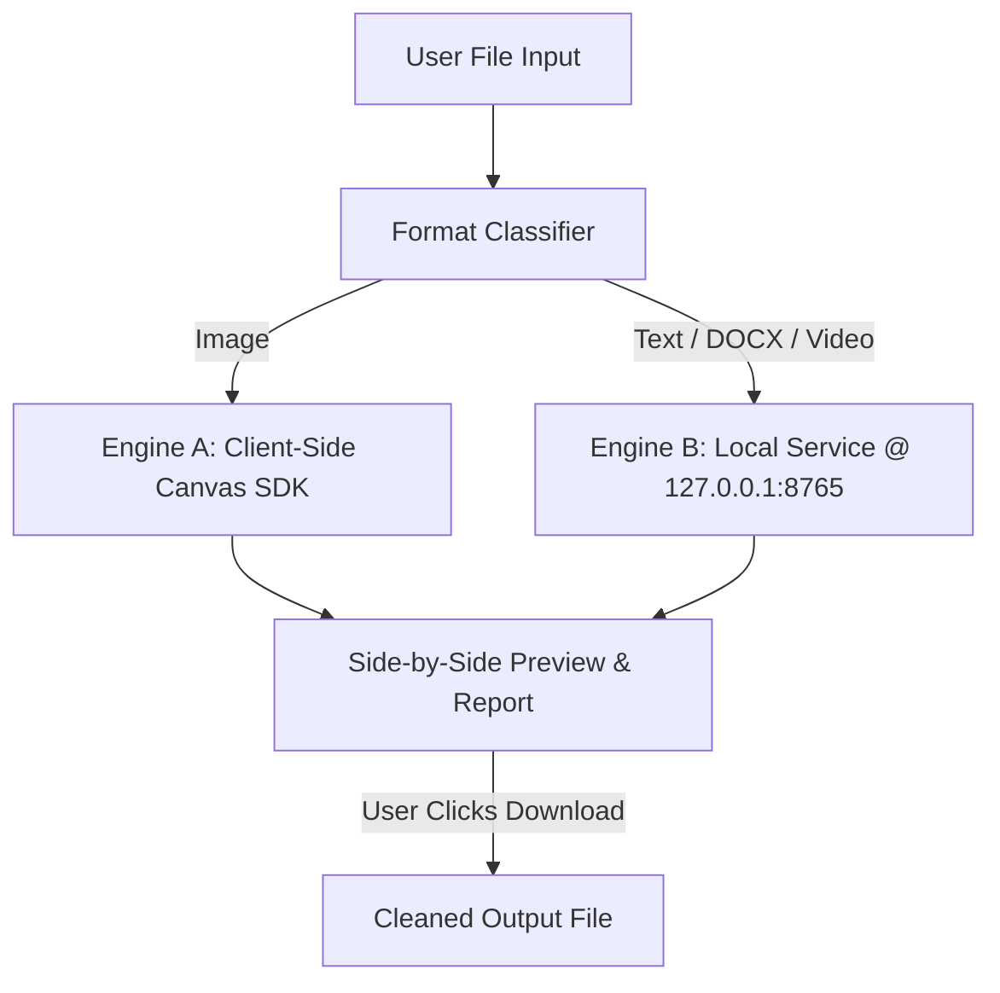

# Xremove

[](LICENSE)
[](https://github.com/GargantuaX/Xremove/releases)

Xremove is a local-first desktop utility for inspecting and cleaning supported watermark and provenance traces from files you own or are authorized to modify.

---

## Highlights

- **100% Local-First**: Files are processed directly on your machine. No mandatory cloud accounts, external APIs, or data transmission.
- **Image Workflow**: Client-side canvas cleaning for supported image watermark workflows with visual before/after comparison.
- **Text & Document Workflow**: Cleans zero-width invisible Unicode watermarks (`U+200B`, `U+200C`, `U+200D`, `U+2060`, `U+FEFF`) and provenance metadata while preserving visible text, formatting, and document structure.
- **Word / DOCX Integrity**: Validates OOXML containers, preserves paragraphs, styles, headings, tables, and page breaks without converting documents to plain text.
- **Safe Preview-Before-Download**: Visual side-by-side comparison before saving. Download occurs only when you explicitly click "Download result".
- **Zero Data Retention**: Temporary Blob and memory buffers are immediately revoked upon reset or window closure.
- **All-in-One Windows Full Release**: Bundles the required companion service so non-technical users do not need to install Python or configure dependencies manually.
- **Video Cleaning (Beta)**: Local video workflow support via companion service.

---

## Responsible Use Notice

> [!IMPORTANT]
> Use Xremove **only** on files you own or are authorized to modify. You are responsible for complying with applicable copyright, contractual, platform, and provenance requirements.

---

## Supported File Formats

| Category | Formats | Processing Engine | Status |
| :--- | :--- | :--- | :--- |
| **Images** | PNG, JPG, JPEG, WEBP | Engine A (In-Browser Client SDK) | **Stable** |
| **Plain Text** | TXT, MD, CSV, JSON, LOG | Engine B (Local Companion Service) | **Stable** |
| **Documents** | DOCX (Word), PDF | Engine B (Local Companion Service) | **Stable** |
| **Videos** | MP4, WEBM, MOV | Engine B (Local Companion Service) | **Beta** |

*Note: Legacy binary `.doc` format (Word 97–2003) is not supported. Please save documents as `.docx`.*

---

## Quick Start — Full Windows Release

For end users on Windows:

1. Download the latest `Xremove-v1.0.0-Full-Windows.zip` from [GitHub Releases](https://github.com/GargantuaX/Xremove/releases).
2. Extract the entire ZIP package into a dedicated folder (e.g., `C:\Program Files\Xremove` or `C:\Users\<User>\Xremove-v1.0.0-Full`).
3. Run `Xremove.exe`.

> [!WARNING]
> Do **not** copy `Xremove.exe` by itself outside the application directory. If you want desktop access, create a Windows shortcut (`.lnk`) pointing to the canonical `Xremove.exe`.

---

## Development Setup

### Prerequisites
- **Node.js**: v20+ or v22+ LTS
- **Package Manager**: `pnpm` (`pnpm@12.1.0` recommended)
- **Python**: 3.10+ (for local Engine B service)

### 1. Install Dependencies
```bash
pnpm install --frozen-lockfile
```

### 2. Bootstrap Upstream Backend
Clone and pin the required upstream companion service:
```bash
pnpm run bootstrap:vendor
```

### 3. Start Development Server
```bash
pnpm run dev
```

### 4. Verification Suite
```bash
# Typecheck
pnpm run typecheck

# Unit tests
pnpm test

# Production bundle build
pnpm run build
```

---

## Architecture Overview

Xremove uses a two-tier architecture designed for privacy and local execution:



- **Engine A**: Powered by [`GargantuaX/gemini-watermark-remover`](https://github.com/GargantuaX/gemini-watermark-remover) (pinned at `bef0303`).
- **Engine B**: Powered by [`guillaumemeyer/watermarks-remover`](https://github.com/guillaumemeyer/watermarks-remover) (pinned at `3f84d3e`).

For technical details, see [docs/ARCHITECTURE.md](docs/ARCHITECTURE.md).

---

## Building the Full Windows Release

To compile the standalone singlefile HTML, native C# launcher, bundle the portable runtime, and generate the release ZIP:

```bash
node scripts/create_release.mjs
```

The output package will be generated at `release/final/Xremove-v1.0.0-Full-Windows.zip`.

For full release procedures, see [docs/RELEASING.md](docs/RELEASING.md).

---

## Documentation

- [docs/ARCHITECTURE.md](docs/ARCHITECTURE.md) — Technical design, classification, and process lifecycle.
- [docs/PRIVACY.md](docs/PRIVACY.md) — Local storage, data flows, and memory isolation.
- [docs/RELEASING.md](docs/RELEASING.md) — Build verification and checksum generation guide.
- [SECURITY.md](SECURITY.md) — Security policy and vulnerability disclosure.
- [CONTRIBUTING.md](CONTRIBUTING.md) — Contribution workflow and testing standards.
- [THIRD_PARTY_LICENSES.md](THIRD_PARTY_LICENSES.md) — Upstream licenses and notices.
- [UPSTREAM_VERSIONS.md](UPSTREAM_VERSIONS.md) — Pinned commit hashes and provenance.

---

## License

- Xremove source code is licensed under the [MIT License](LICENSE).
- Integrated third-party components retain their respective open-source licenses as documented in [THIRD_PARTY_LICENSES.md](THIRD_PARTY_LICENSES.md).
