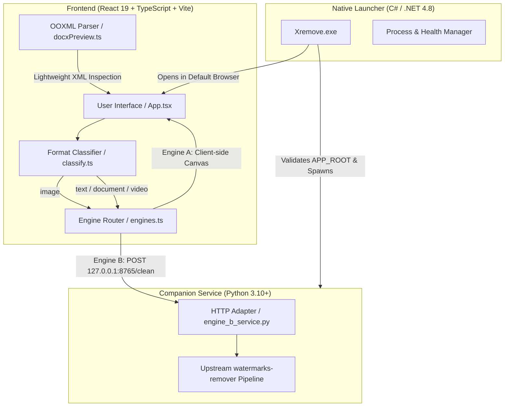

# Xremove Technical Architecture

This document describes the software architecture, module boundaries, routing logic, and execution model of Xremove.

---

## High-Level System Design

Xremove is structured into three primary layers:

---

## 1. Frontend Layer (`src/`)

- **`src/App.tsx`**: Manages application state, language switching, upload dropzone, before/after comparison panes, real-time reports, and download handlers.
- **`src/lib/classify.ts`**: Sniffs file magic bytes, MIME types, and extensions. Distinguishes `image`, `video`, `text`, `document` (DOCX/PDF), and `legacy_doc` (.doc). Ensures binary containers are never mistakenly classified as plain UTF-8 text.
- **`src/lib/docxPreview.ts`**: Lightweight in-browser OOXML extractor using native `DecompressionStream('deflate-raw')`. Reads `word/document.xml`, parses paragraphs and table structures, and generates clean human-readable preview text without corrupting the underlying ZIP container.
- **`src/lib/engines.ts`**: Routes file payloads to either Engine A (in-browser) or Engine B (local HTTP adapter).

---

## 2. Companion Service Layer (`service/`)

- **`service/engine_b_service.py`**:
  - Binds strictly to `127.0.0.1:8765`.
  - Exposes `/health` and `/clean` endpoints.
  - Passes Base64 payloads directly to the vendored `watermarks-remover` pipeline (`_clean_payload()`).
  - Emits diagnostics to `logs/engine-b.log`.

---

## 3. Native Windows Launcher (`launcher/`)

- **`launcher/XremoveLauncher.cs`**:
  - Compiled into `Xremove.exe` via `csc.exe` (C# 5 / .NET 4.8 compatible, present on all standard Windows systems).
  - Validates application directory integrity: verifies presence of `Xremove.html`, `runtime/python/python.exe`, `service/engine_b_service.py`, and `vendor/watermarks-remover`.
  - Displays bilingual guidance if copied loose outside the root application directory.
  - Spawns the companion service silently in the background, polls `/health` until ready, and launches `Xremove.html` in the user's default browser.

---

## 4. Single-File Production Packaging

- During production builds (`vite build`), `vite-plugin-singlefile` bundles all CSS, JavaScript, and asset icons into a self-contained `Xremove.html` file that can execute offline.
